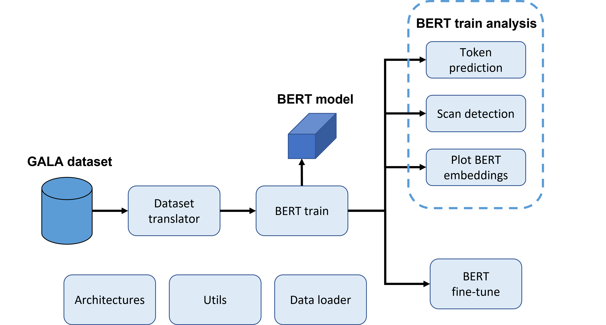

# Mass_spec_NLP_MSc_thesis
This is a repository used during the development of the Master's thesis for MSc Bioinformatics and Systems Biology DTU 2022 with title "Disease prediction from plasma proteomics using Natural Language Processing".

Packages required:
- Pytorch (Using preferred command from https://pytorch.org/get-started/locally/ for your specific case)
- torch.text (https://pypi.org/project/torchtext/)
- pandas
- umap-learn (pip install umap-learn)

